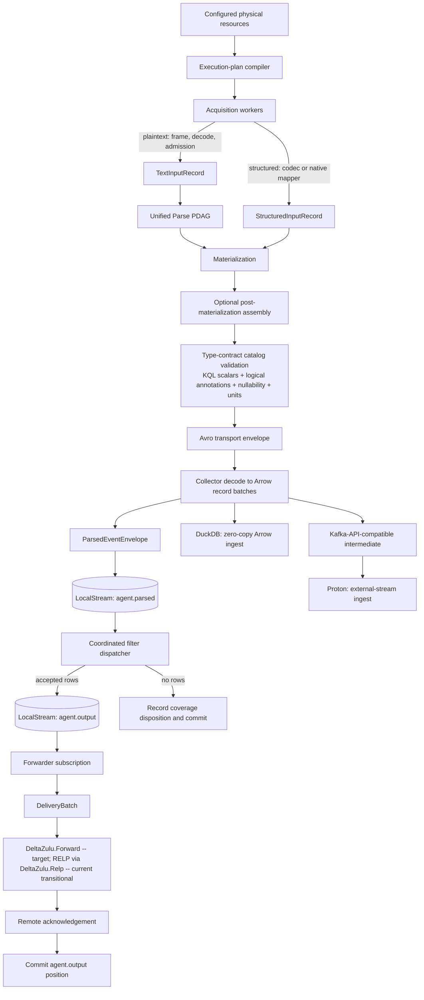

# Target architecture

This is the authoritative target architecture for DeltaZulu.Agent. It replaces the
legacy profile-per-input pipeline and direct DurableBuffer forwarding diagrams.
Implementation sequencing and current migration status are in
[`ROADMAP.md`](ROADMAP.md).

## Invariants

- `DeltaZulu.Pipeline` remains **one** multi-targeted assembly. Folders and
  namespace/dependency tests provide its internal boundaries; no component
  Pipeline projects are introduced.
- Inputs acquire, frame, decode, and map records. They do not parse
  application-specific plaintext.
- `DeltaZulu.Parse` (ADR 0013; renamed from `DeltaZulu.Normalize`) is the sole
  structural parser for unstructured and semi-structured plaintext. Compatible
  rules compile into one PDAG per parser domain, and each plaintext record
  traverses that PDAG once. "Normalize"/"normalization" is reserved for the
  deferred semantic view layer (ADR 0005); Parse's contract is grammar-driven
  typed extraction, not semantic normalization.
- Native or deterministic structured sources bypass Parse.
- A producer-agnostic type-contract catalog (ADR 0010) is the single authority
  for parsed field KQL scalars, logical annotations, nullability, units,
  timestamp precision, and per-backend physical mappings. It generates Avro
  wire schemas, Arrow server schemas, sink DDL, query-translator type tables,
  and governed JSON projections.
- The target agent-to-collector transport is **DeltaZulu.Forward** (ADR 0011):
  a proprietary, RELP-derived but non-wire-compatible reliable framing
  protocol implemented in `DeltaZulu.Pipeline` itself. Until Phase 12a lands
  the target binary/Avro state machine, the checked-in daemon configuration uses
  FORWARDER compatibility framing with MessagePack `DeliveryBatch` payloads.
  Literal RELP is retained only for older validation notes and any future
  rsyslog-world peer input adapter.
- `DeltaZulu.LocalStream` is the Pipeline-visible durability and replay
  boundary: a primitive, non-distributed Kafka alternative for in-agent topics,
  positions, subscriptions, checkpoints, and bounded retention. It is not a
  wrapper around `DeltaZulu.DurableBuffer`; the direct DurableBuffer forwarding
  path is a transitional transport spool and is not an Agent-visible pipeline
  dependency after migration. LocalStream is consumed as a pinned
  `DeltaZulu.LocalStream` NuGet package before it owns daemon persistence.
- Canonical semantic normalization belongs to DeltaZulu.Platform, not the edge
  agent.
- The Proton leg is served through a Kafka-API-compatible intermediate
  protocol (ADR 0012); DeltaZulu writes no bespoke Proton output sink.

## Runtime topology



There is one LocalStream host and two internal physical topics: `agent.parsed`
and `agent.output`. Logical classes such as `sshd`, `sudo`, `sssd`, `pam`, and
`auditd` are envelope topics, not LocalStream topics. The daemon has no
general-purpose output multiplexer; any serialization required by a
non-thread-safe LocalStream producer is private to the publisher adapter.

## Assembly boundaries

```text
src/DeltaZulu.Pipeline/
  Core/             Acquisition, delivery, events, MessagePack, Avro/Arrow
                    schema projections, governed NDJSON edges, observability,
                    and profiles
  Inputs/           Files, network, pipes, syslog, RELP, Windows, framing,
                    decoding, mapping, and transitional legacy adapters
  Parsing/          parse.query compiler, parser domains/generations, PDAG
                    runtime, and topic extraction
  Assembly/         Post-materialization assemblers, initially auditd
  Streaming/        envelopes, publishers, stream runtime, and metrics
  Dispatch/         immutable filter registry and coordinated dispatcher
  Enrichment/       ETW, RPC, and Windows enrichment
  Outputs/          NDJSON and thin RELP/Forward adapters
  Forward/          DeltaZulu.Forward framing, handshake, dedup window, and
                    state machine (ADR 0011; ROADMAP.md Phase 12a; not yet
                    implemented)
  Tunnel/
```

`DeltaZulu.Pipeline` may reference Parse, LocalStream, RELP, deterministic
format libraries, and approved native eventing libraries. It must not reference
Agent Runtime, Daemon, CLI, ProfileWorkbench, or Filter. Runtime owns plan
construction, lifecycle, deduplication, reload, and failure policy. Filter owns
`filter.query` compilation/execution through Rx.Kql. Pipeline owns neither
Rx.Kql nor application orchestration.

## Input and materialization boundaries

Acquisition metadata contains collection facts only: source identity/kind/name,
platform, receipt time, transport, remote address, resource path, and bounded
source properties. Text sources emit a raw message plus that metadata;
structured sources emit native/deterministically decoded fields plus that
metadata.

Plaintext sources flow through Parse. Syslog TCP and UDP may bind the same
numeric port. TCP supports bounded RFC 6587 octet-counted and newline framing.
Admission checks nonempty, bounded, decodable text and a valid PRI (`<0>` to
`<191>`) before a candidate reaches Parse. Admission rejection is measured
separately and is never parser blindness. A valid but unmatched candidate is
published as unrecognized with its raw message preserved.

CSV, Event Log, EVTX, ETL, ETW, and MessagePack `DeliveryBatch` RELP payloads
are structured paths. RELP payload type—not the RELP protocol—determines whether
a record is structured or plaintext.

After materialization, every record is checked against the producer-agnostic
type-contract catalog before it is accepted as a typed event. The catalog is
keyed by canonical field contracts, not by a particular producer or parser;
structured XML, CSV, JSON, Windows, and future native sources must therefore
meet the same logical type checkpoint when they are enabled.

The internal type-bearing transport is Avro generated from that catalog,
carried over DeltaZulu.Forward once Phase 12a lands (RELP-derived FORWARDER
compatibility framing is the current transitional carrier). The collector decodes Avro once into Arrow record
batches. DuckDB ingests from Arrow zero-copy; the Proton leg is fed by a
Kafka-API-compatible intermediate protocol reading from the same Avro/Arrow
representation (ADR 0012) rather than a bespoke sink. NDJSON is not an internal
type-bearing wire format; it is retained only for governed third-party
ingress/egress projections, operator debug taps, and dead-letter/error
envelopes.

Materialization produces `Structured`, `Recognized`, `Unrecognized`, or `Error`.
A recognized Parse match extracts exactly one `topic.<name>` tag from
`event.tags`, while retaining the complete tag array and raw message. An
unrecognized event uses topic `unrecognized` and is still published.

## Profiles, parser generations, and identities

`parse.query` is an optional, backwards-compatible profile property. Its V1
grammar is only:

```kusto
<table>
| parse <field> with (<rule string>, ...)
```

Each rule has exactly one `topic.<name>` routing tag and all rules in one profile
initially use one topic. Parse profiles are grouped by input table, text field,
engine, and dialect. Fragments are ordered by profile ID, profile version, and
rule ordinal; the ordered decoded rulebase produces a stable hash. A replacement
PDAG compiles and validates before an immutable generation is atomically
activated. `filter.query` remains Rx.Kql-owned and is never used to execute
`parse.query`.

Event time is canonicalized as UTC microsecond precision across the pipeline.
Durations carry explicit units; large integers and decimals use typed carriers
rather than JSON doubles; UUID, IP, MAC, enum, nested, variant, and geo fields
require explicit catalog annotations and backend mappings. Null, absent, and
empty-string behavior is a translator contract rather than serializer accident.

Source, parsed-event, and filter-output identities are deterministic from source
position/identity, materialization generation and assembly ordinal, and filter
profile/version/output ordinal respectively. This supports at-least-once replay
without claiming exactly-once delivery. DeltaZulu.Forward's collector-side dedup
window (ADR 0011) makes at-least-once delivery's guaranteed duplicates
transparent to downstream detection logic.

## Dispatch, commits, and observability

The dispatcher resolves all applicable topic/table/resource filters for one
parsed event, executes them sequentially, deterministically orders outputs,
appends all rows to `agent.output`, records a final disposition, then commits
`agent.parsed`. It distinguishes `Forwarded`, `NoCandidate`, `NoMatch`,
`FilterError`, and `OutputError`. A no-output event is deliberately committed
only after its coverage disposition is recorded; errors and failed output appends
are not committed. The forwarder commits `agent.output` only after a successful
delivery acknowledgement (FORWARDER compatibility acknowledgement today; a
DeltaZulu.Forward batch ack once Phase 12a lands).

Metrics separately record acquisition/admission outcomes, structured/recognized/
unrecognized/error materialization, PDAG generation and compilation, dispatch
outcomes, LocalStream append/read/commit/lag/expiry, and forwarding delivery.
Labels are bounded. Parser blindness is an admitted plaintext no-match; filter
blindness separates no-candidate from no-match; complete blindness is an
unrecognized plaintext event with no output. Operational failures are not
blindness. An optional bounded unknown-event diagnostic store retains sampled
fingerprints and representatives outside metrics labels.

## Lifecycle and reload

Startup loads and validates profiles and type-contract catalog generations,
builds acquisition/parser/filter plans, compiles PDAGs and filters, opens
LocalStream, starts forwarder and dispatcher, then starts acquisition.
Shutdown stops admission, flushes materialized records, drains parsed work and
output forwarding according to policy, closes the forwarding transport, then
closes LocalStream. Parser and filter replacements are independently built and
atomically swapped; a failed replacement leaves the active generation intact.
