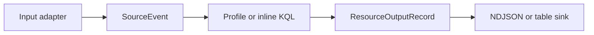

# Architecture

DeltaZulu.Agent is a resource-native collection and forwarding agent. The core invariant is:

```text
Inputs collect.
Parsers expose resource-native fields.
Profiles filter and select with KQL.
The runtime preserves delivery identity.
Outputs write NDJSON or enqueue durable delivery records.
The server performs semantic normalization.
```

The agent does **not** canonicalize fields at the edge. Windows `TargetUserSid`, Sysmon `ProcessGuid`, auditd `EXECVE.ARGV`, syslog `RawMessage`, and similar source-native fields remain source-native. Canonical ECS/SIEM-style mapping belongs on the DeltaZulu server side.

## Hosts

DeltaZulu.Agent currently has three executable hosts:

| Host | Project | Purpose |
| --- | --- | --- |
| `dzagentctl` | `src/DeltaZulu.Agent.Cli` | Thin exploration CLI for schemas, inline KQL, profile testing, table output, and NDJSON export. |
| `dzagentd` | `src/DeltaZulu.Agent.Daemon` | Forwarder-only daemon host using YAML configuration, the shared runtime, `DeltaZulu.DurableBuffer`, and RELP delivery. |
| `dzdemo-collector` | `src/DeltaZulu.Demo.Collector` | Local validation receiver that accepts RELP frames, prints decoded batches, and ACKs with `rsp 200`. |

`dzagentctl` is intentionally convenient for development. `dzagentd` is intentionally smaller: it has no inline query mode, schema listing, table renderer, or ad-hoc export command. Daemon source selection belongs in YAML and resource profiles.

## Project boundaries

```text
src/
  DeltaZulu.Agent.Domain/        Source events, resource records, delivery records, profiles, observations.
  DeltaZulu.Agent.Shared/        Cross-boundary helpers shared by inputs and outputs.
    Ndjson/                      Shared NDJSON serializer options and converters.
  DeltaZulu.Agent.Application/   Runtime orchestration, profile bindings, pipeline helpers, output multiplexing.
  DeltaZulu.Agent.Core/          Compatibility type-forwarding shim for older Agent.Core references.
  DeltaZulu.Agent.Profiles/      YAML profile loading and validation adapter.
  DeltaZulu.Agent.Kql/           Microsoft.Rx.Kql-backed resource profile executor.
  DeltaZulu.Agent.Outputs/        Output adapters grouped by type.
    Ndjson/                       NDJSON console/file sinks, serializer options, and error records.
    Relp/                         Buffered RELP sink, RELP-neutral transport port, RELP.Net adapter, and health reporting.
  DeltaZulu.Agent.Daemon/        YAML-driven forwarder daemon composition root.
  DeltaZulu.Agent.Cli/           Development/exploration CLI composition root.
  DeltaZulu.Agent.Inputs.*       Resource-specific input adapters, including RELP server input.
  DeltaZulu.DurableBuffer/              Durable disk buffer, retry, backpressure, dead-lettering, recovery.
```

Dependency direction is inward: inputs produce domain `SourceEvent` values; KQL and output projects implement application/domain ports; `DeltaZulu.DurableBuffer` owns durable storage mechanics; RELP.Net remains hidden behind the forwarder transport adapter.

## Data flow

### Exploration flow



### Daemon forwarding flow

```mermaid
flowchart LR
    A[YAML source config] --> B[Input adapter]
    B --> C[SourceEvent with source column]
    C --> D[Optional resource profile]
    D --> E[ResourceOutputRecord]
    E --> F[DeliveryRecord with stable DeliveryId]
    F --> G[DeltaZulu.DurableBuffer durable chunk]
    G --> H[ForwarderChunkSender]
    H --> I[RELP.Net transport adapter]
    I --> J[Receiver ACK / retry / dead-letter]
```



Source events expose a KQL `source` column from the native source name. Daemon profiles use that column to select channels or providers, for example `EventLog | where source =~ "Security"` or `Etw | where source =~ "Microsoft-Windows-Kernel-Process"`.

## Output and delivery envelopes

Terminal NDJSON output is one JSON object per line:

```json
{
  "_metadata": {
    "schemaVersion": 1,
    "collectorId": "host01",
    "profileId": "windows.eventlog.security",
    "profileVersion": "1.0.0",
    "sourceType": "WindowsEventLog",
    "sourceName": "Security",
    "platform": "windows",
    "hostname": "host01",
    "ingestedAt": "2026-06-23T12:00:00Z",
    "parserName": "WindowsEventLogInput",
    "parserVersion": "1.0.0",
    "rawPreserved": true
  },
  "event": {
    "EventId": 4625,
    "EventData": {
      "TargetUserSid": "S-1-5-..."
    }
  }
}
```

Forwarding wraps filtered resource output in RELP-neutral delivery records before buffering. `DeliveryId` is generated per delivery envelope and is separate from the event-sourced `RecordId`, giving the server stable at-least-once deduplication material when crashes or network failures cause resend.

The KQL executor preserves source metadata outside user-controlled projections. If a profile omits `_metadata`, the runtime injects fallback delivery identity fields so collector/source/profile context is not accidentally dropped before forwarding.

## Inputs

Implemented input families are:

- syslog file tail and TCP syslog server input,
- CSV file input,
- auditd file/replay input with LAUREL-inspired parsing and assembler behavior,
- Windows Event Log live subscription,
- EVTX file replay,
- ETL file replay,
- ETW real-time session input.

Windows Event Log records expose named XML `EventData` values both under the dynamic `EventData` object and as top-level convenience fields. This supports profile styles such as `EventData.TargetUserSid` and `TargetUserSid`.

## Daemon roles and coordination

`dzagentd` is the service boundary for both endpoint forwarding and collector-style validation. With local sources and `output.mode: relp`, it runs the normal input/filter/RELP path. With a `relp` source from `DeltaZulu.Agent.Inputs/Relp` and `output.mode: console` or `file`, a second instance accepts RELP or RELP-over-TLS and prints or stores decoded records, replacing the separate demo collector path while keeping one daemon binary and two configurations. The merged `DeltaZulu.Agent.Outputs` project keeps RELP forwarding code under the `Relp` folder and `DeltaZulu.Agent.Outputs.Relp` namespace, while console/file sinks stay under `Ndjson` and `DeltaZulu.Agent.Outputs.Ndjson`; shared NDJSON serialization helpers live in `DeltaZulu.Agent.Shared.Ndjson` so inputs and outputs do not depend on each other.

Coordination remains configuration-file based for the current split. The forwarder output path already owns durable queue state in `DeltaZulu.DurableBuffer`, while daemon configuration owns source/profile/output selection; no synchronous request/response decisions are required on the hot path. Named pipes or another IPC channel should only be introduced later for live reconfiguration, administrative health queries, or explicit control-plane commands that cannot be expressed safely by replacing configuration and restarting the supervised daemon process.

## Buffer and forwarder ownership

`DeltaZulu.DurableBuffer` is the authoritative durability and backpressure layer. It owns chunk files, checksums, atomic state transitions, retry scheduling, backpressure policy, recovery, metrics, and dead-letter state. RELP transport ACKs are transport results; durable commit/delete decisions remain on the buffer/application side.

The forwarder path emits health observations through `ForwarderHealthReporter`, including buffer state, disk usage, record/chunk/batch counters, and last activity timestamps. The daemon config controls diagnostic cadence.

## Configuration model

`dzagentd` uses a single YAML file for agent identity, sources, buffer settings, RELP endpoints/TLS policy, and diagnostics:

```yaml
id: local-agent-daemon
sources:
  # Windows Event Log example. Uncomment Linux examples in config/dzagentd.yaml
  # instead when running the Linux build.
  - id: local-windows-security
    input: eventlog
    target: Security
    profile: profiles/windows/eventlog/security.yaml
  # - id: local-syslog
  #   input: syslog
  #   target: /var/log/auth.log
  #   profile: profiles/linux/syslog/sshd.yaml
buffer:
  path: ./buffer/agentd
relp:
  useTls: false
  tls:
    certificateValidation: SystemTrust
  endpoints:
    - host: 127.0.0.1
      port: 6514
diagnostics:
  intervalSeconds: 60
```

Profiles remain resource-local. They should filter and select fields, not normalize source semantics into server-canonical fields.

## Enrichment

Local enrichment is not implemented in this agent. Future enrichment must be optional, typed, resource-local, and compatible with server-side semantic normalization. Candidate providers include SID/account resolution, Windows logon session state, Sysmon process GUID state, auditd process relationship state, and Linux session state.

DuckDB, SQL window engines, and edge-side server-canonical normalization are permanently out of scope.
