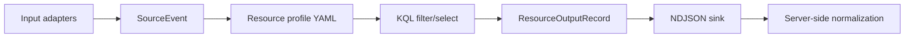

# Architecture

Agent is structured around the following invariant:

```text
Inputs collect.
Parsers expose resource-native fields.
Profiles filter and select with KQL.
Outputs emit structured NDJSON.
The server performs semantic normalization.
```

## Data flow



## Envelope

Agent output is one JSON object per line:

```json
{
  "_metadata": {
    "schemaVersion": 1,
    "collectorId": "host01",
    "profileId": "windows.eventlog.security",
    "profileVersion": "1.0.0",
    "sourceType": "WindowsEventLog",
    "sourceName": "Security",
    "platform": "windows",
    "hostname": "host01",
    "ingestedAt": "2026-06-23T12:00:00Z",
    "parserName": "WindowsEventLogInput",
    "parserVersion": "1.0.0",
    "rawPreserved": true
  },
  "event": {
    "EventId": 4625,
    "EventData": {
      "TargetUserSid": "S-1-5-..."
    }
  }
}
```

`event` keeps source-native field names. Agent does not rename `TargetUserSid` to a canonical field such as `UserSid`. That mapping belongs to the server.

## Inputs

The implementation keeps the RealTimeKql-inspired input families behind `IResourceInput`:

- syslog over TCP and syslog file tailing,
- CSV file input,
- auditd file/replay input with a LAUREL-inspired assembler,
- Windows Event Log,
- EVTX file replay,
- ETL file replay,
- ETW real-time session input.

## KQL stage

The KQL stage runs after parsing. Profiles should use KQL for filtering and field selection, not server-canonical normalization.

Queries should usually include `_metadata` in the projection so the NDJSON writer can preserve host/source/profile context.

## Enrichment

Enrichment is not implemented in this agent. The future model should use typed resource-local state providers, for example:

- `WindowsSidResolver`,
- `WindowsLogonSessionState`,
- `SysmonProcessGuidState`,
- `AuditdProcessState`,
- `LinuxSessionState`.

DuckDB is explicitly out of scope.
